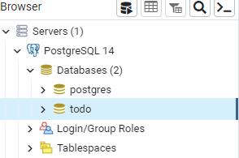
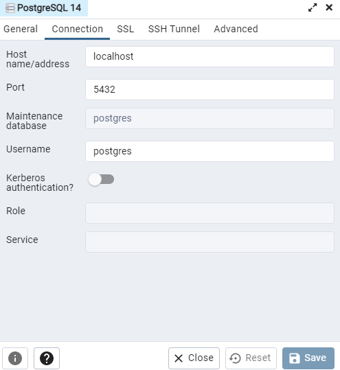
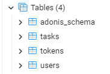
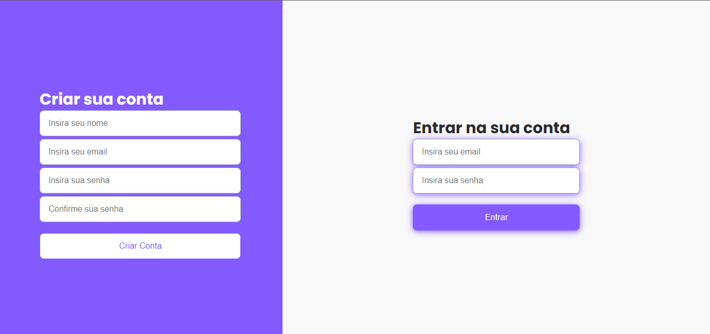
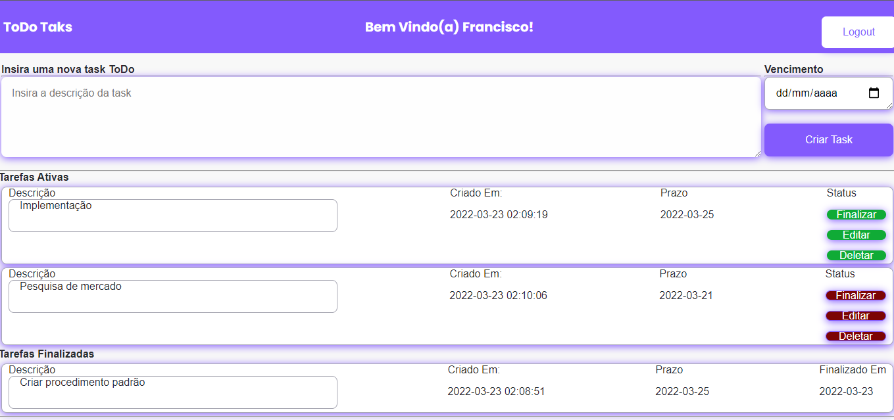
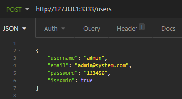
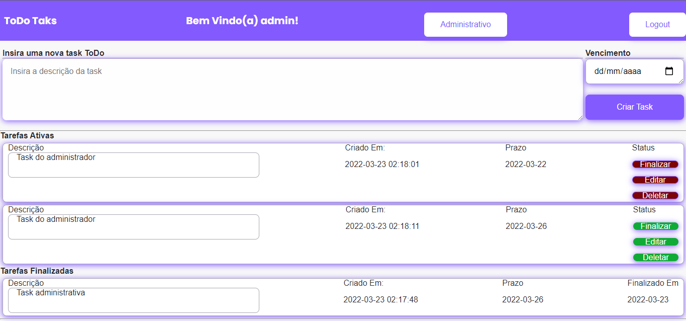
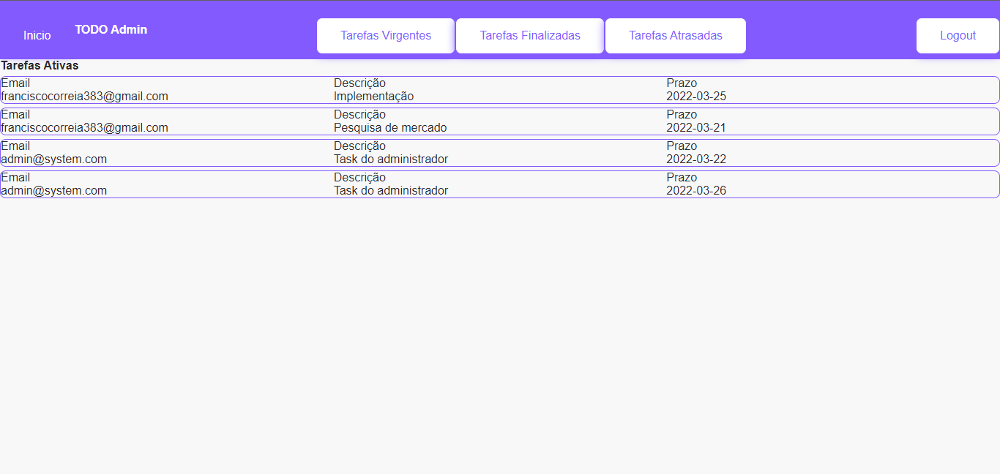

# ToDo Tasks

A aplicação Todo foi desenvolvida com frontend React, backend AdonisJs e banco de dados Postgres.

Para funcionamento adequado da aplicação deve-se executar os seguintes passos:

## Instalação
Baixar e instalar o [Nodejs](https://nodejs.org/en/)

Baixar e instalar o [Postgres](https://postgres.org/)

Baixar e instalar o [Insomnia](https://insomnia.rest/download)

Baixar este repositório e descompactar.

Após instalar o Postgres, abra o pgAdmin e crie um banco de dados com nome "todo"



Caso o postgres não venha com server padrão, clique em criar server

*   Insira qualquer nome para o server, va em connection e insira localhost no hosted



Lembrando de guardar a senha e a porta a qual foi criado o banco

# Configuração Backend

Entre o terminal na pasta backend do projeto e execute o comando:

```bash
npm install yarn
```

Depois de instalar o yarn, rodar o comando yarn ou npm install para instalar as depedencias do projeto.

```bash
yarn
```
```bash
npm install
```

Após instalar as dependencias do projeto, instalar o CLI do AdonisJs

```bash
yarn add @adonisjs/cli
```

Em casos de error de permissão ao instalar o Cli no macos rodar o comando:

```bash
sudo npm install -g @adonisjs/cli --unsafe-perm=true --allow-root
```

Após instalar o CLI do AdonisJs, Abrir o código backend no editor de textos.

Na raíz do projeto, criar o arquivo .env e inserir as seguintes informações:

```node
HOST=127.0.0.1
PORT=3333
NODE_ENV=development
APP_NAME=AdonisJs
APP_URL=http://${HOST}:${PORT}
CACHE_VIEWS=false
APP_KEY=dScWvmnAlqUXjhAqDG2LBgBAIHj9TAJG

DB_CONNECTION=pg
DB_HOST=127.0.0.1
DB_PORT=5432
DB_USER=postgres
DB_PASSWORD=
DB_DATABASE=todo

HASH_DRIVER=bcrypt
```

## Importante: Inserir a senha que foi criada no banco de dados em DB_PASSWORD

Após inserir as informações no arquivo .env, rodar o comando de criação das tabelas no banco de dados:

```bash
adonis migration:run
```

Verificar se ocorreu a criação das tabelas no pgAdmin.



Execute o comando para iniciar o servidor backend:

```bash
adonis serve --dev
```

# Configuração Frontend
Entre o terminal na pasta frontend do projeto e execute o comando:

```bash
npm install yarn
```

Depois de instalar o yarn, rodar o comando yarn ou npm install para instalar as depedencias do projeto.

```bash
yarn
```
```bash
npm install
```

Após instalação das dependencias, executar comando para iniciar o servidor frontend:

```bash
yarn start
```
Em casos de problemas com a versão do node-sass inserir o comando:

```bash
yarn add node-sass
```


#   Cadastro de usuários

Para criar um usuário comum, basta preencher as informações da tela de autenticação e, após a mensagem de sucesso, realizar o login:



# Tasks todo

Após o usuário fazer login na aplicação ele é redirecionado para a página Home, a qual ele só consegue acessar caso esteja autenticado na aplicação com o devido token de sessão.

Na página Home o usuário pode cadastrar novas tasks todo, verificar as tasks em atraso sinalizadas com botões vermelho.

O usuário pode editar, finalizar e excluir suas tasks todo.

O usuário comum só consegue ter acesso as suas próprias tasks todo

O usuário consegue realizar o logout o que lhe redireciona para a tela de login.

O backend também garante que as rotas de tasks só consigam serem acessadas atraves de um usuário devidamente logado na aplicação.



# Usuário Administrativo
Para cadastrar um usuário administrador, abrir o insomnia e enviar uma requisição do tipo post no backend:

```url
http://127.0.0.1:3333/users
```

```JSON
    {
        "username": "admin",
        "email": "admin@system.com",
		"password": "123456",
		"isAdmin": true
    }
```



O usuário administrativo além de ter acesso a suas proprias tasks todo, tem acesso a todas as tasks virgentes, em atraso e finalizadas de todos os usuários através do botão Administrativo.






## Create By
[Francisco Correia](https://www.linkedin.com/in/francisco-correia-a09143134/)